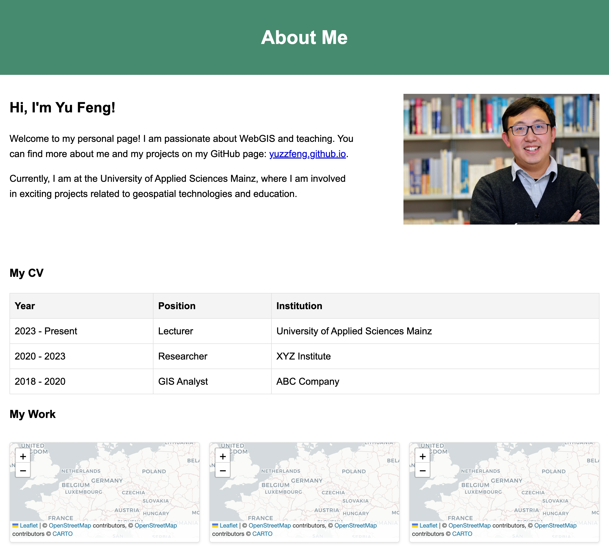

Geoinformatik 2 – Web-GIS
# Übung 1 · Statische Webseite mit Copilot in VS Code
Prof. Dr. Yu Feng

## Lernziele
Nach dieser Übung können Sie:
- mit Copilot ein statisches HTML-Dokument erzeugen und anpassen;
- Grundbausteine einer Webseite einsetzen: Text, Überschriften, Tabelle, Bild, Links;
- eine 1×3-Galerie bauen, deren Kacheln auf externe Links führen;
- eine Seite responsiv, zugänglich (alt-Texte) und leichtgewichtig gestalten;
- die Seite ohne Kommandozeile auf Netlify deployen.

## Überblick
- https://subtle-tulumba-d7b8e7.netlify.app/

## Aufgaben
Erstelle eine persönliche Startseite `index.html` (ohne Frameworks, kein JS nötig), die **mindestens** Folgendes enthält:

1. **Intro**: `<h1>` + 1–2 Absätze über dich.  
2. **Kurz-CV als Tabelle**: 2–4 Spalten, 4–8 Zeilen (Jahr · Station · Ort · Stichwort).  
3. **Ein Foto**: z. B. `assets/me.jpg`, mit sinnvollem `alt` und kurzer Bildunterschrift.  
4. **Galerie 1×3**: drei Karten/Teaser (Bild + Titel + Kurztext), **Klick → externer Link** (z. B. GitHub, Portfolio, Fotoblog).  
5. **Grund-CSS**: gut lesbar, mobilfreundlich (≤ 720 px → 1-spaltig).  
6. **Zugänglichkeit**: alt-Texte, klare Linktexte/`aria-label`, ausreichender Farbkontrast.  
7. **Deployment**: Upload zu **Netlify** und Freigabe des Live-Links.

## Empfohlene Copilot-Prompts

**Prompt 1 – Grundgerüst + Inhalte**  
> *„Erzeuge eine minimalistische persönliche Startseite als **einzelne `index.html`** (ohne Frameworks). Inhalte: (1) Titel + 1–2 Absätze; (2) **Tabelle** mit 6 Stationen (Jahr, Station, Ort, Stichwort); (3) **Bild** `assets/me.jpg`; (4) **Galerie 1×3** mit drei Karten (Bild, Titel, Kurztext), die **auf externe Links** führen. Anforderungen: semantisches HTML5 (`header`, `main`, `section`, `figure`, `table`), responsives **CSS** (max-width, Grid/Flex), guter Farbkontrast, System-Schriftarten. Alles in **einer Datei** liefern (inkl. `<style>`).“*

**Prompt 2 – Look & Feel verfeinern**  
> *„Passe Farben an (Akzent #2563eb), erhöhe Zeilenhöhe/Abstände, füge Karten-Schatten & abgerundete Ecken hinzu, mache die Tabelle mit Hover-Zeilen, und stelle sicher: ≤ 720 px → Galerie 1-spaltig.“*

**Prompt 3 – Galerie-Links ersetzen**  
> *„Ersetze die drei Galerie-Karten durch: GitHub (Link …), Portfolio (Link …), Fotoblog (Link …). Verwende Platzhalterbilder `https://picsum.photos/600/400?random=1..3`, ergänze `aria-label` je Link.“*

---

## Erwartete Webseite

  

