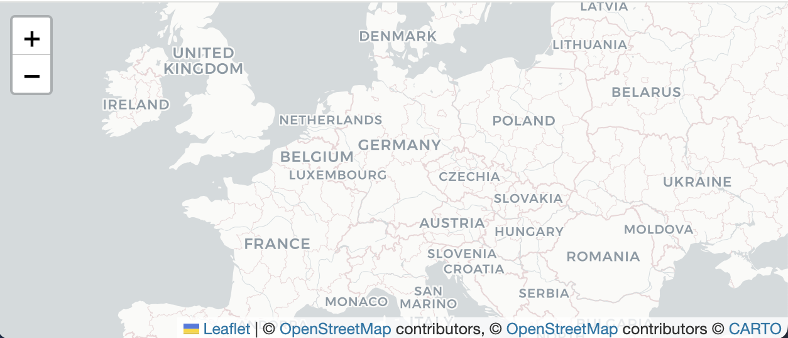
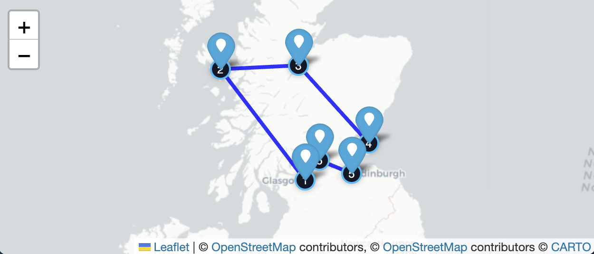
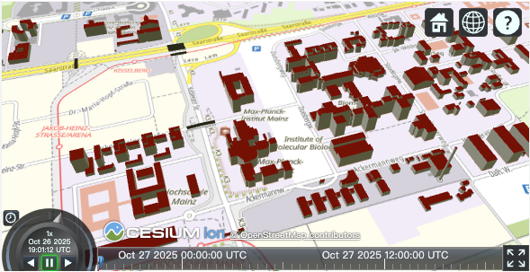

Geoinformatik 2 – Web-GIS
# Übung 3 · Webkarte mit APIs and SDKs
Prof. Dr. Yu Feng

## Lernziele
Nach dieser Übung können Sie:
- mit **Folium** (Leaflet in Python) eine interaktive Karte erzeugen,
- **Punkte**, **Linien** und **Flächen (GeoJSON/Polygon)** visualisieren,
- Popups/Tooltips und LayerControl nutzen,
- andere Webkarten in die eigene Webseite einbinden

## Aufgabe 1 - Webkarte mit Folium/Python
- Colab Notebook https://drive.google.com/file/d/1Tt8KefdDQxWbimkvMBNkVWvVIC6xYv4D/view?usp=sharing

## Aufgabe 2 - Webkarten in eigene Webseite einbinden

Wenn Sie die mit Folium erzeugten HTML-Dateien (z. B. `maps/map_1_basiskarte.html`) auf einer eigenen Seite einbinden möchten, verwenden Sie ein `<iframe>`:

- Auf GitHub Pages lautet die URL typischerweise:  
  `https://<IhrGitHubName>.github.io/Geoinformatik2_HS_Mainz/Uebung3/maps/map_1_basiskarte.html`
- Alternativ können Sie die HTML-Datei auf jeden beliebigen Webspace hochladen und den Pfad entsprechend anpassen.

## Aufgabe 3 - Deutschland 3D-Gebäude mit Cesium einbinden

Hier gibt es einen 3D‑Gebäudelayer für ganz Deutschland. Bitte binden Sie ihn mit **Cesium** in Ihre eigene Webseite ein.

- Info/Quelle: https://basemap.de/produkte-und-dienste/3d/

## Aufgabe 4 - Erweiterte Webvisualisierung mit weiteren APIs

Nutzen Sie zusätzlich zu Leaflet/Cesium weitere Bibliotheken, die wir im Kurs besprochen haben, um anspruchsvollere Visualisierungen zu erstellen. Beispiele:

- Kepler.gl
  - Interaktive Explorationskarten ohne Programmierung
  - Vorgehen: Karte in Kepler.gl erstellen → Export → "Export Map" → "HTML" → die exportierte HTML in dieses Repo legen (z. B. `Uebung3/assets/kepler_map.html`) und per `<iframe>` einbinden.
  - Links: https://kepler.gl/

- Three.js
  - Für eigene 3D-Visualisierungen (Extrusionen, Partikel, Animationen)
  - Typische Wege: GeoJSON einlesen → in Three.js-Geometrie konvertieren → Materialien/Beleuchtung/Kamera konfigurieren
  - Startpunkte: https://threejs.org/ (Docs, Beispiele)

## Beispiel-Output

- https://yuzzfeng.github.io/Geoinformatik2_HS_Mainz/Uebung3/ 

## Erwartete Karten

<table>
  <tr>
    <td>
      
      
<em>1) Basiskarte</em>

    </td>
    <td>
      
      
<em>2) Punkte (Marker)</em>

    </td>
  </tr>
  <tr>
    <td>
      
      
<em>3) Reiseroute (Polyline)</em>

    </td>
    <td>
      
      
<em>4) Flächen (GeoJSON)</em>

    </td>
  </tr>
  <tr>
    <td>
      
      
<em>5) 3D Stadt</em>

    </td>
  </tr>
</table>