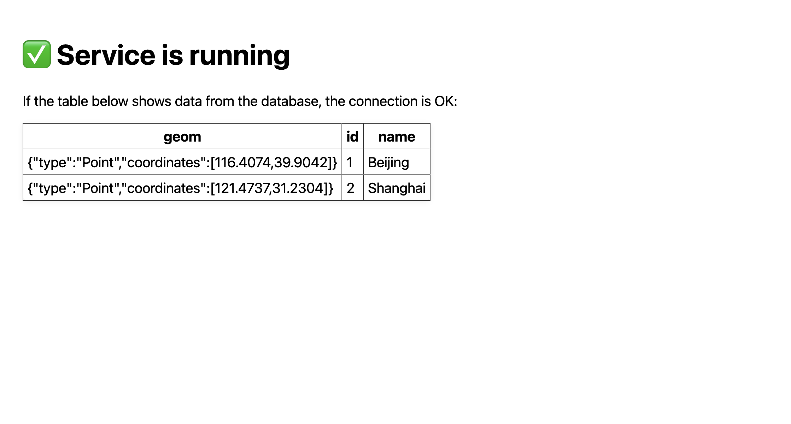

Geoinformatik 2 – Web-GIS
# Übung 4 · Docker-Grundlagen: Flask + PostGIS
Prof. Dr. Yu Feng

## Lernziele
Nach dieser Übung können Sie:
- Installation und erster Umgang mit Docker Desktop (macOS, Windows)  
- Starten von zwei Containern mit `docker-compose`:  
  - **db**: PostGIS-Datenbank  
  - **web**: Flask-Webanwendung  
- Verständnis für Container Networking (Kommunikation zwischen Web ↔ Datenbank)  
- Aufbau einer minimalen Web-GIS-Anwendung: Lesen von Punkten aus PostGIS und Bereitstellung als JSON-API (`/api/places`)  

## Schritt 1 · Docker installieren
1. **Docker Desktop** herunterladen und installieren:  
   
   - macOS (Apple Silicon): https://docs.docker.com/desktop/setup/install/mac-install/ 
   
   - Windows: https://docs.docker.com/desktop/setup/install/windows-install/  

   > **⚠️ Wichtig für Windows-Nutzer:**  
   > Manche ältere Windows-Versionen (z. B. Windows 10 Home vor Version 21H2 oder Windows ohne WSL 2-Unterstützung) können Docker Desktop nicht ausführen.  
   > 
   > **Bitte vorher prüfen:**  
   > - Fragen Sie **ChatGPT** oder **GitHub Copilot**: *"Unterstützt meine Windows-Version Docker Desktop? Ich nutze [Ihre Windows-Version und Build-Nummer]."*  
   > - Windows-Version anzeigen: `⊞ Win` + `R` → `winver` eingeben → Enter  
   > 
   > **Falls Ihr System nicht kompatibel ist:**  
   > - Arbeiten Sie mit einem Kommilitonen zusammen, der Docker nutzen kann

2. Installation prüfen:  
   ```bash
   docker --version
   docker compose version
   ```

3. Erste Schritte mit Docker (Hello World):  
   ```bash
   # Docker Hello World Container ausführen
   docker run hello-world
   ```

4. Erste Server mit Docker (nginx):   
   
   ```bash
   # Einen einfachen Webserver starten
   docker run -d -p 8080:80 --name my-nginx nginx:alpine
   
   # Im Browser öffnen: http://localhost:8080
   # (Sie sollten die nginx Willkommensseite sehen)
   
   # Container stoppen und entfernen
   docker stop my-nginx
   docker rm my-nginx
   ```

## Schritt 2 · Projektstruktur
Erstelle ein Verzeichnis `Uebung4/` mit folgender Struktur:  
```
Uebung4/
├─ docker-compose.yml
├─ db/
│   ├─ Dockerfile
│   └─ initdb/
│       ├─ 01_init.sql
│       └─ 10_postgis.sh
└─ web/
    ├─ Dockerfile
    ├─ requirements.txt
    ├─ app.py
    └─ templates/
        └─ index.html
```

---

## Schritt 3 · PostGIS-Datenbank

Das **db/Dockerfile** erstellt ein PostGIS-Image und packt die Initialisierungsskripte direkt mit hinein. Die SQL-Dateien aus `db/initdb/` werden beim ersten Start der Datenbank automatisch ausgeführt und legen Tabellen und Beispieldaten an.

Wir kopieren die Skripte ins Image (statt sie als Volume zu mounten), damit das fertige Image überall ohne externe Abhängigkeiten läuft und Berechtigungsprobleme zwischen verschiedenen Betriebssystemen vermieden werden.

**db/Dockerfile**  
```dockerfile
FROM postgis/postgis:16-3.4

# Als root Verzeichnis und Berechtigungen vorbereiten
USER root
RUN mkdir -p /docker-entrypoint-initdb.d \
 && chown -R postgres:postgres /docker-entrypoint-initdb.d \
 && chmod 755 /docker-entrypoint-initdb.d

# Skripte kopieren und Besitzer direkt auf postgres setzen
COPY --chown=postgres:postgres initdb/*.sql /docker-entrypoint-initdb.d/
COPY --chown=postgres:postgres initdb/*.sh  /docker-entrypoint-initdb.d/

# Angemessene Berechtigungen setzen (.sh ausführbar, .sql lesbar)
RUN set -eux; \
    chmod 755 /docker-entrypoint-initdb.d/*.sh 2>/dev/null || true; \
    chmod 644 /docker-entrypoint-initdb.d/*.sql 2>/dev/null || true

# Zurück zu postgres (vom offiziellen Entrypoint erwarteter Benutzer)
USER postgres
```

Das **Initialisierungsskript** aktiviert die PostGIS-Erweiterung, erstellt eine Tabelle `places` mit einer Geometrie-Spalte für Punkte (SRID 4326 = WGS84) und fügt zwei Beispielstädte (Beijing und Shanghai) mit ihren Koordinaten ein.

**db/initdb/01_init.sql**  
```sql
CREATE EXTENSION IF NOT EXISTS postgis;
DROP TABLE IF EXISTS places;
CREATE TABLE places (
  id SERIAL PRIMARY KEY,
  name TEXT,
  geom GEOMETRY(Point, 4326)
);

INSERT INTO places (name, geom) VALUES
 ('Beijing', ST_SetSRID(ST_MakePoint(116.4074,39.9042),4326)),
 ('Shanghai', ST_SetSRID(ST_MakePoint(121.4737,31.2304),4326));
```

---

## Schritt 4 · Flask-Webanwendung


Die **requirements.txt** listet die benötigten Python-Pakete auf: Flask für das Web-Framework, psycopg2 für PostgreSQL-Verbindung und SQLAlchemy als Datenbank-Toolkit.

**web/requirements.txt**  
```
Flask==3.0.0
psycopg2-binary==2.9.9
SQLAlchemy==2.0.35
```

Das **web/Dockerfile** baut ein Python-Image, installiert die Dependencies und startet die Flask-Anwendung mit `python app.py`.

**web/Dockerfile**  
```dockerfile
FROM python:3.11-slim
WORKDIR /app
COPY requirements.txt /app/requirements.txt
RUN pip install --no-cache-dir -r /app/requirements.txt
COPY . /app
CMD ["python","app.py"]
```

Die **app.py** definiert drei Routen: `/` für die Startseite (rendert HTML-Template), `/api/health` als Healthcheck und `/api/places` zum Abrufen der Orte aus PostGIS als GeoJSON.

**web/app.py**  
```python
from flask import Flask, render_template, jsonify
from sqlalchemy import create_engine, text
import os

app = Flask(__name__)

# Datenbank-URL aus Umgebungsvariable lesen (db = Container-Name als Host)
DB_URL = os.getenv("DATABASE_URL", "postgresql://postgres:postgres@db:5432/postgres")
engine = create_engine(DB_URL, pool_pre_ping=True)

@app.get("/")
def home():
    # Rendert /templates/index.html
    return render_template("index.html")

@app.get("/api/health")
def health():
    return jsonify({"ok": True})

@app.get("/api/places")
def places():
    with engine.connect() as conn:
        rows = conn.execute(text("""
            SELECT id, name, ST_AsGeoJSON(geom) AS geom
            FROM places ORDER BY id
        """)).mappings().all()      # rows: list[RowMapping]
    data = [{"id": r["id"], "name": r["name"], "geom": r["geom"]} for r in rows]
    return jsonify(data)

if __name__ == "__main__":
    app.run(host="0.0.0.0", port=5000)
```

---

## Schritt 5 · Docker-Compose

Die **docker-compose.yml** orchestriert beide Container (`db` und `web`): Sie definiert den Build-Kontext, Umgebungsvariablen, Port-Mappings und stellt sicher, dass der Web-Container erst startet, wenn die Datenbank bereit ist (via `healthcheck`).

**docker-compose.yml**  
```yaml
version: "3.9"
services:
  db:
    platform: linux/amd64
    build:
      context: ./db
      dockerfile: Dockerfile
    environment:
      POSTGRES_PASSWORD: postgres
      POSTGRES_USER: postgres
      POSTGRES_DB: postgres
    ports:
      - "5432:5432"
    volumes:
      - dbdata:/var/lib/postgresql/data   # Nur Datenvolume (persistente Speicherung)
    healthcheck:
      test: ["CMD-SHELL", "pg_isready -U postgres"]
      interval: 5s
      timeout: 5s
      retries: 10

  web:
    build:
      context: ./web
      dockerfile: Dockerfile
    depends_on:
      db:
        condition: service_healthy
    environment:
      DATABASE_URL: postgresql://postgres:postgres@db:5432/postgres
      FLASK_APP: app.py
      FLASK_ENV: development
    ports:
      - "5000:5000"
    command: python app.py
    working_dir: /app

volumes:
  dbdata:
```

---

## Schritt 6 · Container starten
```bash
# ⚠️ Nur bei Problemen: Alles löschen und von vorne beginnen (inkl. Datenbank-Daten!)
# docker compose down -v --remove-orphans

# Images bauen (ohne Cache, um saubere Builds zu garantieren)
docker compose build --no-cache

# Container im Hintergrund starten (-d = detached mode)
docker compose up -d

# Status der Container anzeigen (läuft? Ports? etc.)
docker compose ps
```

> **💡 Hinweis zu Fehlern:**  
> Es ist völlig normal, wenn bei diesem Schritt Fehler auftreten! Unterschiedliche Betriebssysteme, Docker-Versionen und Abhängigkeiten können zu verschiedenen Problemen führen. Bei Fehlern:
> - Kopieren Sie die vollständige Fehlermeldung
> - Fragen Sie **GitHub Copilot** oder **ChatGPT** mit der Fehlermeldung
> - Die KI kann oft schnell die Ursache identifizieren und eine Lösung vorschlagen

**Ergebnis testen:**
- Browser: `http://localhost:5000/` → Startseite  
- API: `http://localhost:5000/api/places` → JSON mit Beijing & Shanghai  

---

👉 Mit dieser Übung lernen wir:  
- Grundaufbau von Docker-Containern und Compose-Dateien  
- Zusammenspiel von Datenbank-Service  
- Ein erstes Web-GIS-API mit Flask + PostGIS

## Deine Aufgabe
Erweitern Sie die Datei index.html und 01_init.sql, sodass anstelle der eingegebenen Daten die Standorte von Mainz, Frankfurt am Main, und Wiesbaden auf einer Leaflet-Karte visualisiert werden.

## Erwartete Webseite

<p align="center">
  
</p>


