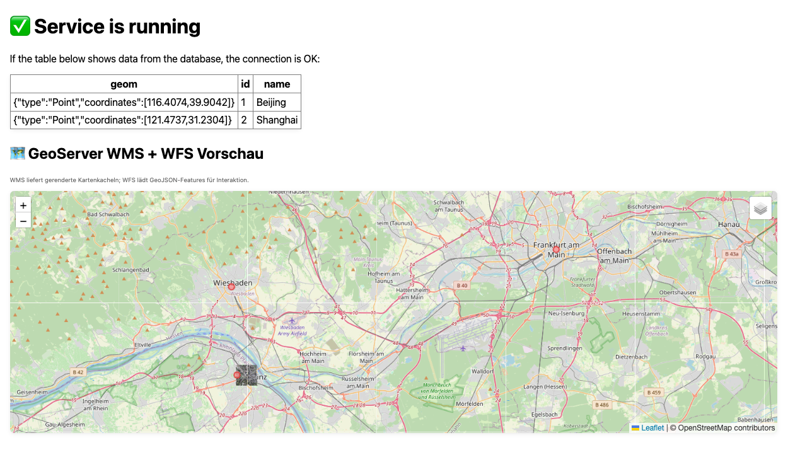

Geoinformatik 2 – Web-GIS
# Übung 5 · GeoServer-Integration: WMS & WFS
Prof. Dr. Yu Feng

## Lernziele
Nach dieser Übung können Sie:
- Einen **GeoServer** als Docker-Container aufsetzen und konfigurieren
- GeoServer-Workspace, Datastore und Layer automatisch per REST-API erstellen
- **GeoTIFF-Dateien** als WMS (Web Map Service) bereitstellen
- **GeoJSON-Daten** in PostGIS importieren und als WFS (Web Feature Service) publizieren
- WMS-Layer und WFS-Layer in einer Leaflet-Webkarte kombinieren und anzeigen
- Multi-Container-Orchestrierung mit `docker-compose` (PostGIS, Flask, GeoServer, GDAL)
- Geodaten-Workflows automatisieren: Import → Speicherung → Publikation → Visualisierung

## Überblick
Diese Übung baut auf **Übung 4** (Flask + PostGIS) auf und erweitert das System um einen **GeoServer** zur professionellen Geodaten-Publikation:

### Architektur (5 Services)
1. **db** (PostGIS): Datenbank für Vektordaten  
2. **web** (Flask): Web-Anwendung mit interaktiver Karte  
3. **geoserver** (Kartoza GeoServer): OGC-konformer Map-Server  
4. **geoserver-init**: Automatische GeoServer-Konfiguration via REST-API  
5. **gdal-import**: Automatischer Import von GeoJSON nach PostGIS  

### Geodaten-Pipeline
```
GeoTIFF (mainz.tif)  →  GeoServer  →  WMS  →  Leaflet
GeoJSON (points.geojson)  →  PostGIS  →  GeoServer  →  WFS  →  Leaflet
```

### Was wird publiziert?
- **WMS-Layer**: `uebung:mainz` (Raster-Basiskarte aus GeoTIFF)  
- **WFS-Layer**: `uebung:points` (Interaktive Punkte aus PostGIS: Mainz, Wiesbaden, Frankfurt)  
- **Datenbank-Test**: `places`-Tabelle (Beijing, Shanghai) für Verbindungsprüfung

---

## Schritt 1 · Projektstruktur verstehen

```
Uebung5/
├─ docker-compose.yml          # Orchestrierung aller Services
├─ db/
│   ├─ Dockerfile               # PostGIS mit Init-Skripten
│   └─ initdb/
│       ├─ 01_init.sql          # Erstellt 'places'-Tabelle
│       └─ 10_postgis.sh        # Platzhalter für PostGIS-Initialisierung
├─ geodata/                     # Zu publizierende Geodaten
│   ├─ mainz.tif                # GeoTIFF (wird als WMS publiziert)
│   └─ points.geojson           # Vektordaten (werden in PostGIS importiert)
├─ geoserver_init/
│   ├─ Dockerfile               # Image für GeoServer-Konfiguration
│   └─ init_geoserver.sh        # REST-API-Skript: Workspace, Datastore, Layer
├─ scripts/
│   ├─ Dockerfile               # GDAL-Image mit eingebettetem Import-Skript
│   └─ import_geojson.sh        # ogr2ogr: GeoJSON → PostGIS
└─ web/
    ├─ app.py                   # Flask-App mit /api/places und WMS/WFS-Seite
    └─ templates/index.html     # Leaflet-Karte mit WMS + WFS Overlay
```

---

## Schritt 2 · Container starten

```bash
# In Uebung5/ Verzeichnis
cd Uebung5/

# ⚠️ Nur bei Problemen: Alles löschen und von vorne beginnen (inkl. Datenbank-Daten!)
# docker compose down -v --remove-orphans

# Alle Images bauen
docker compose build --no-cache

# Services starten
docker compose up -d

# Status prüfen (alle Services sollten "healthy" sein)
docker compose ps
```

**Wichtig:** Beim ersten Start kann es 1-2 Minuten dauern, bis GeoServer vollständig initialisiert ist.

---

## Schritt 3 · Funktionen testen

### 1. Flask-Webseite
**URL:** http://localhost:5000/

**Erwartung:**
- Oben: Tabelle mit `places`-Daten (Beijing, Shanghai) → Datenbankverbindung OK ✅
- Unten: Interaktive Karte mit:
  - OpenStreetMap Basiskarte
  - WMS-Layer: `uebung:mainz` (GeoTIFF-Hintergrund)
  - WFS-Layer: `uebung:points` (klickbare Punkte: Mainz, Wiesbaden, Frankfurt)

### 2. GeoServer Admin-Panel
**URL:** http://localhost:8080/geoserver/  
**Login:** `admin` / `geoserver`

**Prüfen Sie:**
- **Layer Preview** → `uebung:mainz` (WMS) und `uebung:points` (WFS)
- **Workspaces** → Workspace `uebung` existiert
- **Stores** → PostGIS-Datastore `pg_places` verbunden

### 3. WMS GetCapabilities
**URL:** http://localhost:8080/geoserver/uebung/wms?service=WMS&request=GetCapabilities

**Erwartung:** XML mit `<Layer><Name>mainz</Name></Layer>`

### 4. WFS GetFeature (GeoJSON)
**URL:** http://localhost:8080/geoserver/uebung/ows?service=WFS&version=2.0.0&request=GetFeature&typeName=uebung:points&outputFormat=application/json

**Erwartung:** GeoJSON mit 3 Features (Mainz, Wiesbaden, Frankfurt)

---

## Schritt 4 · Wie funktioniert die Automation?

### GeoServer-Initialisierung (`geoserver-init`)
Das `init_geoserver.sh`-Skript läuft einmalig nach GeoServer-Start und führt automatisch aus:

1. **Workspace erstellen:** `uebung`
2. **PostGIS-Datastore erstellen:** `pg_places` (Verbindung zu `db:5432/postgres`)
3. **Layer publizieren:**
   - `places` (aus PostGIS-Tabelle)
   - `points` (falls in PostGIS vorhanden)
4. **GeoTIFF auto-publizieren:** Alle `*.tif` in `/data/` (z.B. `mainz.tif`) werden als WMS CoverageStore angelegt

**REST-API Beispiel (Workspace):**
```bash
curl -u admin:geoserver -H "Content-type: application/xml" \
  -d '<workspace><name>uebung</name></workspace>' \
  -X POST http://localhost:8080/geoserver/rest/workspaces
```

### GeoJSON-Import (`gdal-import`, optional)
Falls `points.geojson` noch nicht in PostGIS ist, importiert das `import_geojson.sh`-Skript automatisch:

```bash
ogr2ogr -f PostgreSQL \
  PG:"host=db user=postgres password=postgres dbname=postgres" \
  /data/points.geojson \
  -nln points -t_srs EPSG:4326
```

---

## Schritt 5 · Troubleshooting

### Problem: GeoServer zeigt Layer nicht an
**Lösung:**
```bash
# GeoServer-Logs prüfen
docker compose logs geoserver

# Init-Skript nochmal ausführen
docker compose run --rm geoserver-init
```

### Problem: WFS liefert keine Daten
**Prüfen Sie, ob Tabelle in PostGIS existiert:**
```bash
docker compose exec db psql -U postgres -d postgres -c '\dt'
docker compose exec db psql -U postgres -d postgres -c 'SELECT * FROM points;'
```

**Falls Tabelle fehlt:**
```bash
docker compose run --rm gdal-import
```

---

## Erwartete Webseite

<p align="center">
  
</p>

---

## Deine Aufgaben

1. **Neues Raster aus GeoPortal RLP herunterladen, konvertieren und publizieren:**
   - Öffnen Sie den INSPIRE-Download-Link des GeoPortal RLP (Beispiel):
     https://www.geoportal.rlp.de/mapbender/plugins/mb_downloadFeedClient.php?url=https%3A%2F%2Fwww.geoportal.rlp.de%2Fmapbender%2Fphp%2Fmod_inspireDownloadFeed.php%3Fid%3D2b009ae4-aa3e-ff21-870b-49846d9561b2%26type%3DSERVICE%26generateFrom%3Dremotelist
   - Laden Sie eine benachbarte Kachel (z.B. als .zip oder .gml) herunter und konvertieren Sie sie mit GDAL/QGIS zu GeoTIFF (`.tif`).
   - Speichern Sie die GeoTIFF-Datei in `geodata/` und publizieren Sie sie:
     - Variante A: Container kurz neu starten (GeoServer erkennt neue Dateien unter `/data`).
     - Variante B: Initialisierung erneut ausführen:
       
       docker compose run --rm geoserver-init
   - Prüfen: Layer-Preview in GeoServer sollte einen neuen WMS-Layer (z.B. `uebung:<dateiname>`) anzeigen.
   - **Leaflet:** Fügen Sie diesen neuen WMS-Layer als dritten Layer in die Webkarte ein.

2. **OSM-Datenpunkte (z.B. Café, Restaurant) herunterladen, als GeoJSON konvertieren und publizieren:**
   - Nutzen Sie Overpass Turbo (https://overpass-turbo.eu/) oder eine andere OSM-API, um relevante POIs (z.B. Café, Restaurant) für Ihre Region als GeoJSON zu exportieren.
   - Speichern Sie die GeoJSON-Datei in `geodata/` und publizieren Sie sie als WFS-Layer:
     - Variante A: Automatischer Import durch gdal-import (falls aktiviert).
     - Variante B: Manuell importieren:
       
       docker compose run --rm gdal-import
   - Prüfen: Layer-Preview in GeoServer sollte einen neuen WFS-Layer (z.B. `uebung:cafes` oder `uebung:restaurants`) anzeigen.
   - **Leaflet:** Fügen Sie diesen neuen WFS-Layer als vierten Layer in die Webkarte ein.

---

👉 **Mit dieser Übung lernen Sie:**
- Professionelle Geodaten-Publikation mit OGC-Standards (WMS/WFS)
- Automatisierung von GIS-Workflows mit Docker + REST-API
- Integration von Raster (GeoTIFF) und Vektor (GeoJSON/PostGIS) in einer Webkarte


