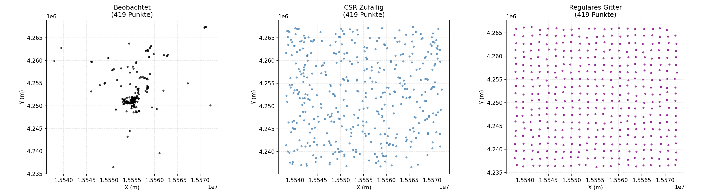
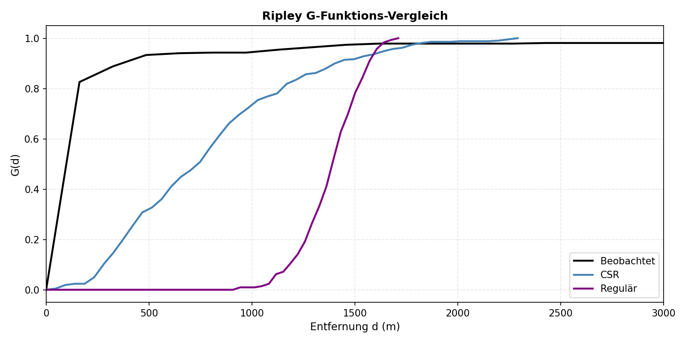
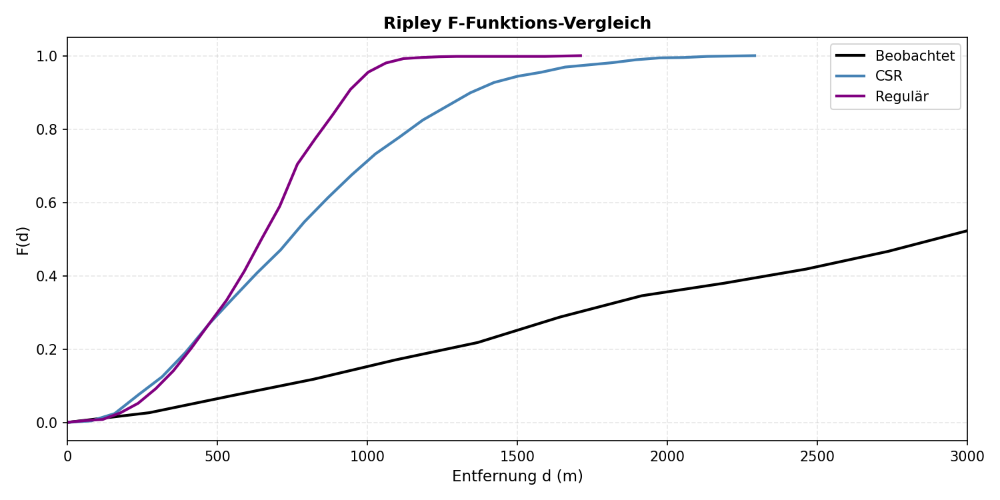
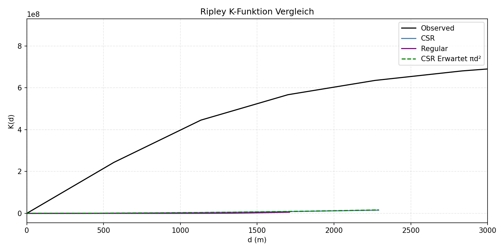
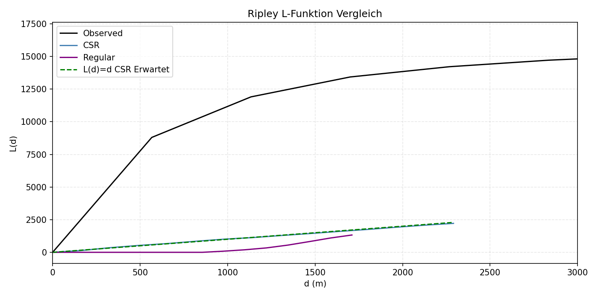

Geoinformatik 2 – GIS-Analyse
# Übung 8: Punktmusteranalyse mit Ripley Funktionen
Prof. Dr. Yu Feng

## Überblick

Diese Übung analysiert räumliche Punktmuster von Flickr-Fotos aus Tokio mithilfe von Ripley-Funktionen. Wir vergleichen das beobachtete Muster mit zwei Referenzmustern: **CSR (Complete Spatial Randomness)** und **Reguläres Muster**.

## Visualisierungen

### Punktmustervergleich

Drei Mustertypen mit jeweils 419 Punkten: Beobachtete Flickr-Fotos zeigen deutliche Clusterung, CSR als zufällige Referenz, und reguläres Gitter als gleichmäßige Verteilung.

### G-Funktion: Nächster-Nachbar-Abstände

Beobachtet steigt schnell an (viele kurze Abstände = Clusterung), Regulär steigt langsam an (große Mindestabstände = gleichmäßig), CSR liegt dazwischen.

### F-Funktion: Leerraum-Analyse

Beobachtet steigt langsam an (große Leerräume zwischen Clustern), Regulär steigt schnell an (keine Lücken), CSR liegt dazwischen.

### K-Funktion: Paardichte

Beobachtet liegt über der Erwartung πd² (mehr Nachbarn = Clusterung), Regulär liegt darunter (weniger Paare = gleichmäßig), CSR entspricht der Erwartung.

### L-Funktion: Normalisierte K-Funktion

L(d) = √(K(d)/π). Beobachtet über der Linie L(d)=d (Clusterung), Regulär darunter (Regularität), CSR nahe der Linie (Zufälligkeit).

## Referenzen

- [Geographic Data Science with Python](https://geographicdata.science/book/notebooks/08_point_pattern_analysis.html)
- [pointpats Dokumentation](https://pysal.org/notebooks/explore/pointpats/distance_statistics.html)

